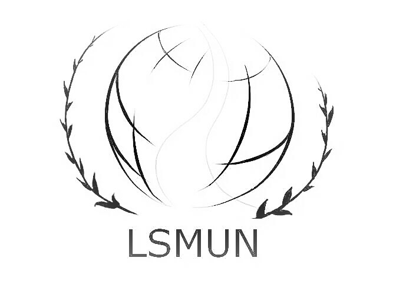
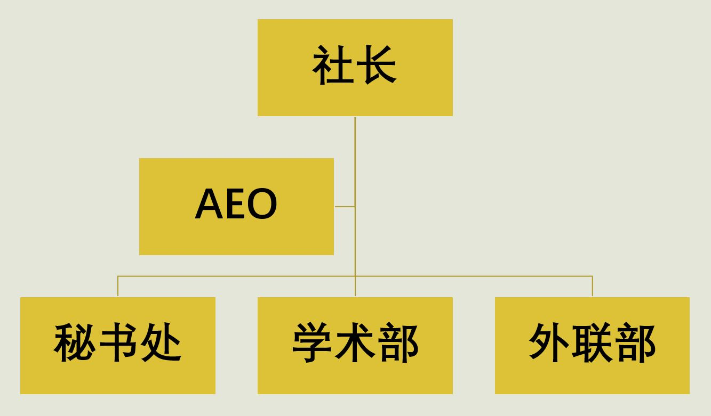

*[<<主页](https://www.lsmun.club/)*

# 关于我们

麓山国际实验学校模拟联合国社团（Lushan International Experimental School Model United Nations, LSMUN）成立于2010年。作为一个校直属的社员自治社团，LSMUN内部洋溢着自由而严谨的学术氛围以及温馨和谐的人际关系。一直以来，LSMUN都是校内学术性最强的社团，社员们自主、自由地进行学术研究与交流，积极地参与会议，展现出一个既严肃又活泼的社团形象。

***

## 组织结构

LSMUN由社长领导，下设社长助理（临）及秘书处、学术部、外联部三个机构，分别由秘书长、学术部部长、外联部部长领导。

***

> 现任2018-19届社领导层与2017-18届领导层合影

### 社长：邱世杰 G1714

### 社长助理(AEO)：曾胤哲 G1702 & 彭昊仪 G1708

### 秘书处 | 秘书长：姚鑫 G1702

负责总体安排，统筹，内部监督等工作。

### 学术部 | 部长：陈启维 G1705

#### 副部长 刘迟予（常务） G1703 & 沈睿杰 G1706 & 肖惟宸 G1710

负责学术工作。

### 外联部 | 部长：段启航 G1710

#### 副部长 邹尹宛迪 G1713

负责对外（友好学校模联，赞助商，会议组织方等）联系，新闻推送等工作。

---

## 奖项

2015 宾夕法尼亚大学全球中学生模拟联合国大会最佳立场文件奖

2016 泛中全国模拟联合国大会最佳代表奖

2016 上海平和全国中学生模拟联合国大会最佳组织奖

2016 上外附中-牛津模拟联合国大会最佳代表团（一人获得杰出代表奖，两人获得最佳立场文件奖）

2017 WEMUN EXPO 2017杰出组织奖

2018 广东碧桂园学校-康奈尔大学模拟联合国中国会议最佳组织奖

etc.

[about this page/for contributors](https://www.lsmun.club/README.md)
